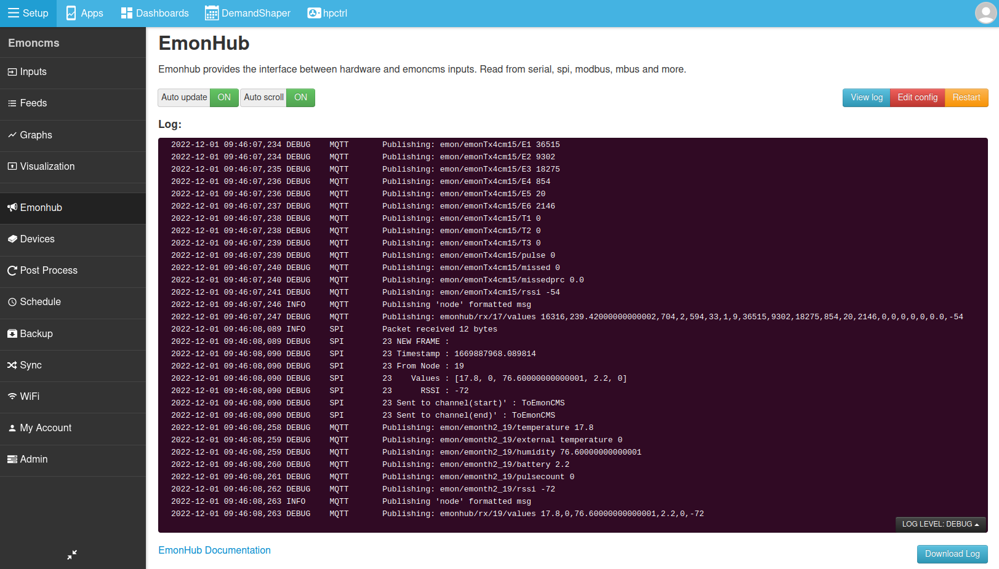

# emonHub Overview

## Introduction

EmonHub is a piece of software running on the emonPi and emonBase that can read/subscribe or send/publish data to and from a multitude of services. It is primarily used as the bridge between the OpenEnergyMonitor monitoring hardware and the Emoncms software but it can also be used to read in data from a number of other sources, providing an easy way to interface with a wider range of sensors.

```{admonition} emonCMS inputs not updating?
emonHub is a good place to look first. [Check the emonHub log](#view-the-emonhub-log) and configuration. See below for more details.
```

---

## Features

This version of emonhub is based on [@pb66 Paul Burnell's](https://github.com/pb66) original adding:

- Internal pub/sub message bus based on pydispatcher
- Publish to MQTT
- Https Emoncms interface
- A multi-file implementation of interfacers.
- Rx and tx modes for node decoding/encoding provides improved control support.
- json based config file option so that emonhub.conf can be loaded by emoncms

---

## Basic Concept

A number of individual **Interfacers** can be configured within emonHib to collect data from multiple sources and distribute that information to multiple targets, but different protocols.

In its simplest form, it takes data from a Serial Interface and transforms it to a format suitable for emoncms to take as an Input, then sends it to emoncms via HTTP or MQTT.

Each Interfacer communicates by creating *channels* much like an MQTT Broker, that allows the Interfacer to *Publish* data to a channel and *Subscribe* (get) data from a channel. Each interfacer can communicate over multiple channels.

Each interfacer can listen on a `subchannel` or publish on a `pubchannel`. Some interfacers can do both. An Interfacer needs at least one channel defined of either type.

**For Example:**

The Serial Interfacer listens on the serial port then publishes that data for onward transmission - it has a `pubchannel` defined.

The MQTT interfacer listens for data which it then sends out via MQTT, it therefore defines a `subchannel` that it will listen on for data to send via MQTT.

For data to be passed, the name of the 2 channels must match.

Each interfacer can have multiple channels defined and multiple interfacers can listen to the same channel. e.g. data published by the Serial Interfacer can be listened (subscribed) for by the MQTT and the HTTP interfacer.

**Note** The channel definition is a list so must end with a comma e.g. `pubchannels = ToEmonCMS,` or `pubchannels = ToEmonCMS,ToXYZ,`

## View the emonHub log

The emonHub log is a useful place to look if you are trying to troubleshoot problems with inputs not updating in emoncms. If `loglevel = DEBUG` is set in the `[hub]` section of the emonHub configuration file, you should see a stream of activity in the emonhub log.

To access the emonHub log from within emonCMS running on the emonPi/emonBase/RaspberryPi. Navigate to Setup > EmonHub.



Alternatively the emonHub log can be viewed via command line:

    tail -f /var/log/emonhub/emonhub.log -n1000
    
### Making sense of the log

These messages indicate that a new frame of data is being received, via the interfacer named SPI and on node 17 in this case with the values as indicated. The frame is being sent to the internal emonHub channel `ToEmonCMS`:

```
2022-12-01 09:50:53,993 INFO     SPI        Packet received 52 bytes
2022-12-01 09:50:53,994 DEBUG    SPI        36 NEW FRAME : 
2022-12-01 09:50:53,995 DEBUG    SPI        36 Timestamp : 1669888253.994002
2022-12-01 09:50:53,996 DEBUG    SPI        36 From Node : 17
2022-12-01 09:50:53,996 DEBUG    SPI        36    Values : [3, 240, 11, 11, 11, 5, 5, 5, 0, 0, 0, 0, 0, 0, 19.12, 300, 300, 0, -2, -100.0]
2022-12-01 09:50:53,996 DEBUG    SPI        36      RSSI : -44
2022-12-01 09:50:53,997 DEBUG    SPI        36 Sent to channel(start)' : ToEmonCMS
2022-12-01 09:50:53,997 DEBUG    SPI        36 Sent to channel(end)' : ToEmonCMS
```

In the standard emonSD configuration, data frames received and passed on to the `ToEmonCMS` channel are then published via MQTT. You should see a series of lines that look something like this:

    2022-12-01 09:51:03,218 DEBUG    MQTT       Publishing: emon/emonTx4_17/MSG 1

emonCMS is seperately subscribed to the `emon/` MQTT channel and will show these messages as emoncms inputs.

## Installing Emonhub

### emonScripts

emonHub can be installed by making suitable modifications to the emonScripts script.

### Manual Install

Install emonHub:

```bash
git clone https://github.com/openenergymonitor/emonhub.git
cd emonhub
git checkout stable
sudo ./install.sh
```

To view the emonhub log via terminal on the emonpi or emonbase:

```bash
journalctl -f -u emonhub
```

If the MQTT Interfacer is to be used, Mosquitto needs to be installed.

```bash
sudo apt-get update
sudo apt-get install -y mosquitto
```

It is recommended to turn off mosquitto persistence

```bash
sudo nano /etc/mosquitto/mosquitto.conf
```

Set

```text
persistence false
```

